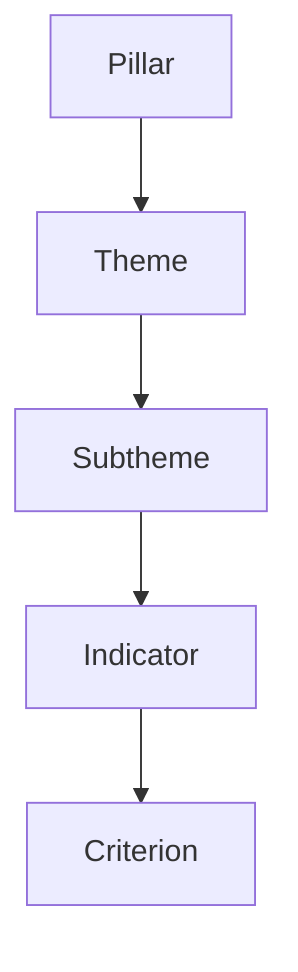

# Shelter and Settlements Severity Index Tool – Project Guide

This document is the **single source of truth** for the design, architecture, and conventions of this repo.  
It ensures that future contributors (human or AI) follow consistent standards.

---

## 1. Project Overview

- **Name**: Shelter and Settlements Severity Index Tool
- **Purpose**: A framework management and analysis tool for humanitarian indicators, criteria, and scoring.
- **Stack**:
  - Next.js 15 (App Router)
  - Supabase (Postgres + Auth + Storage)
  - TailwindCSS 3
  - TypeScript
  - lucide-react (icons)
  - Jest + React Testing Library (unit tests)

---

## 2. Directory Structure

```
app/                         # Next.js App Router pages
├── layout.tsx               # Global themed layout
├── globals.css              # Tailwind base styles
├── page.tsx                 # Dashboard (home)
├── framework/
│   ├── page.tsx             # Framework landing
│   ├── primary/editor/      # Primary framework editor
│   │   ├── page.tsx
│   │   ├── PrimaryFrameworkEditorClient.tsx
│   │   ├── PrimaryFrameworkCards.tsx
│   │   ├── actions.ts       # (future) action handlers
│   │   └── error.tsx
│   └── comprehensive/editor/
│       └── page.tsx         # Comprehensive editor (placeholder)
├── country/page.tsx         # Country config (placeholder)
├── ssc/page.tsx             # SSC management (placeholder)
└── about/page.tsx           # About page

components/                  # Shared UI components
├── PageHeader.tsx
├── CsvActions.tsx
└── PrimaryFrameworkCards.tsx

lib/                         # Utility libs
└── utils.ts

types/                       # TypeScript definitions
└── framework.ts

tests/ or __tests__/         # Jest + RTL unit tests
├── PrimaryFrameworkCards.test.tsx
└── PrimaryFrameworkEditorClient.test.tsx

tailwind.config.js
postcss.config.js
package.json
PROJECT_GUIDE.md             # This file
README.md
```

---

## 3. Database Schema (Supabase)

### Current Tables

```sql
-- Pillars (highest level)
create table pillars (
  id uuid primary key default gen_random_uuid(),
  code text not null,
  name text not null,
  description text,
  sort_order int not null
);

-- Themes (child of pillars)
create table themes (
  id uuid primary key default gen_random_uuid(),
  code text not null,
  name text not null,
  description text,
  sort_order int not null,
  pillar_id uuid references pillars(id) on delete cascade
);

-- Subthemes (child of themes)
create table subthemes (
  id uuid primary key default gen_random_uuid(),
  code text not null,
  name text not null,
  description text,
  sort_order int not null,
  theme_id uuid references themes(id) on delete cascade
);
```

### Future Tables (Indicators & Criteria)

```sql
-- Indicators (child of subthemes)
create table indicators (
  id uuid primary key default gen_random_uuid(),
  code text not null,
  name text not null,
  description text,
  sort_order int not null,
  subtheme_id uuid references subthemes(id) on delete cascade
);

-- Criteria (child of indicators)
create table criteria (
  id uuid primary key default gen_random_uuid(),
  code text not null,
  description text not null,
  weight numeric, -- scoring weight
  indicator_id uuid references indicators(id) on delete cascade
);
```

**Hierarchy**:  
`Pillars → Themes → Subthemes → Indicators → Criteria`

---

## 4. Data Fetching

- All data is fetched via Supabase in **server components** using `createServerClient`.
- Cookies are injected from `next/headers`.

### Query Pattern

```ts
supabase
  .from("pillars")
  .select("*, themes!themes_pillar_id_fkey(*, subthemes(*))")
  .order("sort_order", { ascending: true });
```

When indicators/criteria are added, this will extend:

```ts
supabase
  .from("pillars")
  .select(`
    *,
    themes!themes_pillar_id_fkey(
      *,
      subthemes(
        *,
        indicators(
          *,
          criteria(*)
        )
      )
    )
  `)
  .order("sort_order", { ascending: true });
```

---

## 5. TypeScript Types

Defined in `types/framework.ts`:

```ts
export type Criterion = {
  id: string;
  code: string;
  description: string;
  weight: number;
  indicator_id: string;
};

export type Indicator = {
  id: string;
  code: string;
  name: string;
  description: string;
  sort_order: number;
  subtheme_id: string;
  criteria: Criterion[];
};

export type Subtheme = {
  id: string;
  code: string;
  name: string;
  description: string;
  sort_order: number;
  theme_id: string;
  indicators: Indicator[];
};

export type Theme = {
  id: string;
  code: string;
  name: string;
  description: string;
  sort_order: number;
  pillar_id: string;
  subthemes: Subtheme[];
};

export type Pillar = {
  id: string;
  code: string;
  name: string;
  description: string;
  sort_order: number;
  themes: Theme[];
};
```

---

## 6. UI Standards

- **TailwindCSS** with global base styles in `app/globals.css`.
- **Icons** via `lucide-react`.
- **Dashboard** (`/`) is the **home page**:
  - Card-based navigation
  - Each block links into a feature area
- **Page Layout (`app/layout.tsx`)**:
  - Top nav: tool title + logo placeholder
  - Footer with © notice
  - Consistent padding (`p-6`) on content
- **PageHeader Component**:
  - Props: `title`, `breadcrumbItems`, `actions?`
  - Renders breadcrumbs, title, and actions (e.g. CSV upload/download)
- **Primary Framework Editor Table**:
  - Columns: `Type/Code | Name/Description | Sort Order | Actions`
  - Codes: small, grey text
  - Collapsible hierarchy (Pillars → Themes → Subthemes)
  - Default collapsed
  - Sorted by `sort_order`
  - Actions: Edit / Delete / Up / Down (greyed until wired)

---

## 7. Navigation

```
Dashboard (/)
  ├── Framework (/framework)
  │    ├── Primary Editor (/framework/primary/editor)
  │    └── Comprehensive Editor (/framework/comprehensive/editor)
  ├── Country Config (/country)
  ├── SSC Management (/ssc)
  └── About (/about)
```

Breadcrumbs always start at **Dashboard**.

---

## 8. Testing

- Testing framework: **Jest + React Testing Library**.
- Example tests:
  - `PrimaryFrameworkCards.test.tsx`: verifies rendering of Pillars → Themes → Subthemes.
  - `PrimaryFrameworkEditorClient.test.tsx`: verifies error, empty, and populated states.
- Future: add tests for API routes and UI interactions (expand/collapse, CSV upload).

---

## 9. Future Development

- Add **Indicators** and **Criteria** tables to DB + type definitions.
- Extend Supabase queries to nest Indicators + Criteria.
- Build **Comprehensive Framework Editor** to manage Indicators/Criteria.
- Implement **Country Configuration** and **SSC Management** pages.
- Add **Auth** (Supabase) for admin-only access.
- Wire up **action icons** (edit, delete, reorder).
- Implement **CSV Upload/Download** integration.
- Add **About page** content and branding.

---

# 🔑 Key Conventions

- **DB schema**: hierarchical, strongly typed, with `sort_order` controlling display order.
- **Navigation**: Dashboard = home, consistent breadcrumbs.
- **UI**: Tailwind for layout, lucide-react for icons, consistent headers + cards.
- **Testing**: React Testing Library for UI components.
- **Extendability**: Future-proofed to add Indicators + Criteria.

---

## 10. Visual Schema


